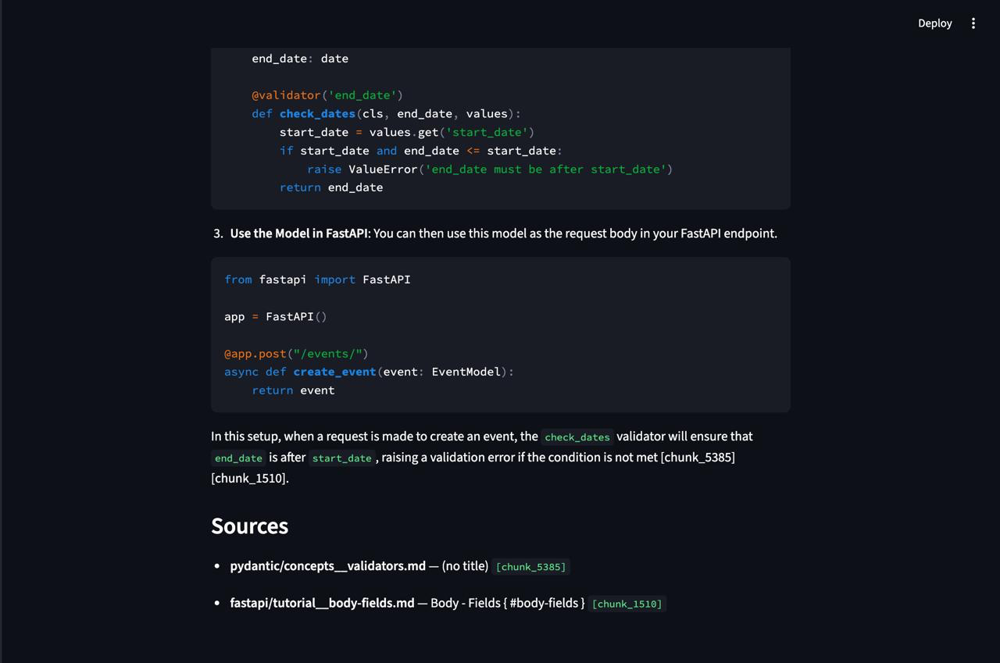
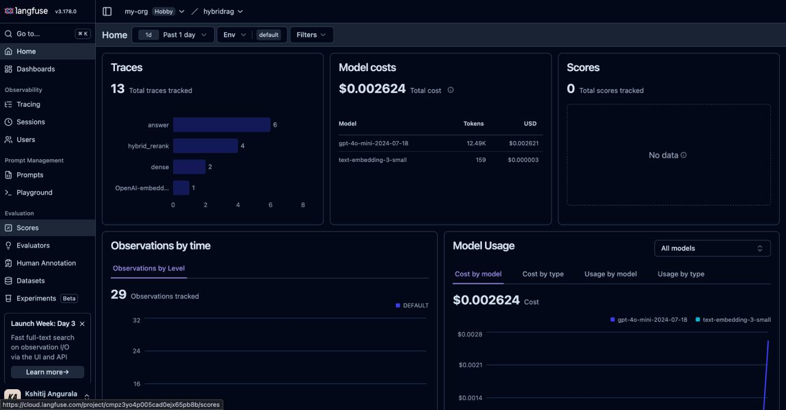

# Hybrid RAG with pgvector + Cohere Rerank-3.5

> **A retrieval-augmented Q&A system over technical documentation. Combines pgvector semantic search, Postgres full-text search, and a Cohere cross-encoder reranker, then answers with citation-grounded GPT-4o-mini.**

Built with hybrid retrieval (dense + sparse fused via **Reciprocal Rank Fusion (RRF)**), an optional rerank stage reorders retrieved documents using a more accurate relevance model so the most contextually useful chunks are sent to the LLM, inline citation grounding traceable back to source chunks, and end-to-end LLM observability via Langfuse.


## What it does

This is a learning-focused implementation that combines semantic retrieval (dense) and keyword-based search (sparse) to improve grounding over technical documentation, enabling natural-language question answering with inline chunk-level citations back to the original source content.

Four retrieval modes are exposed so you can see what each technique contributes to the final ranking.

**Indexed corpus** (5,753 chunks across 6 sources):

| Source | Files | Chunks |
|---|--:|--:|
| HuggingFace Transformers | 300 | 2,810 |
| FastAPI | 153 | 1,935 |
| Pydantic | 88 | 689 |
| LangChain | 26 | 167 |
| LangGraph | 16 | 120 |
| Anthropic cookbook | 13 | 32 |
| **Total** | **596** | **5,753** |


## Demo

**Cross-source query** — *"How do I validate cross-field constraints on a Pydantic model used as a FastAPI request body — for example, ensuring `end_date` is after `start_date`?"*

The system retrieves from both the Pydantic and FastAPI corpora, generates a runnable answer, and cites the specific chunks that grounded each claim:



Every `/ask` request becomes one Langfuse trace tree — retrieval span, Cohere rerank, LLM generation — with token cost and latency captured per step:




## Architecture

```
                ┌───────────────────────────────────────┐
                │  data/corpus/<source>/*.md            │
                │  (596 markdown files, 6 sources)      │
                └────────────────┬──────────────────────┘
                                 │ ingest.py
                                 ▼
              ┌───────────────────────────────────┐
              │  chunk.py  — header-aware split   │
              │  → 800-token chunks (100 overlap) │
              └────────────────┬──────────────────┘
                               │
                               ▼
              ┌───────────────────────────────────┐
              │  embed.py — text-embedding-3-small│
              │  (1536 dims, batches of 100)      │
              └────────────────┬──────────────────┘
                               │ upsert
                               ▼
           ┌────────────────────────────────────────────┐
           │  Postgres 16 + pgvector — chunks table     │
           │   id, source, doc_id, chunk_index, title,  │
           │   text, embedding (HNSW), tsv (GIN)        │
           └─────────────────┬──────────────────────────┘
                             │
                             │ retrieve.py
                             ▼
   ┌─────────────────────────────────────────────────────────┐
   │   dense   sparse   hybrid (RRF)   hybrid_rerank         │
   │     │        │          │            │                  │
   │     └────────┴──────────┴────────────┘                  │
   │                       │                                 │
   │          top-K chunks (default K=5)                     │
   └───────────────────────┬─────────────────────────────────┘
                           │
                           ▼
              ┌─────────────────────────────────┐
              │  llm.py — gpt-4o-mini           │
              │  + citation grounding           │
              │    ([chunk_<id>] markers)       │
              └────────────────┬────────────────┘
                               │
            ┌──────────────────┴──────────────────┐
            ▼                                     ▼
   ┌────────────────┐                  ┌──────────────────┐
   │  FastAPI       │                  │  Streamlit UI    │
   │  POST /ask     │                  │  (browser)       │
   └────────────────┘                  └──────────────────┘
```


## Retrieval modes

| Mode | How it works | Strengths | Weakness |
|---|---|---|---|
| `dense` | pgvector cosine on text-embedding-3-small | semantic match, synonym handling | misses exact API names / unusual tokens |
| `sparse` | Postgres `tsvector` + `ts_rank_cd` | exact keyword hits, ~15ms | no concept generalization |
| `hybrid` | RRF fusion of dense + sparse | catches both signal types | rewards cross-source keyword collisions |
| `hybrid_rerank` | hybrid candidates → Cohere rerank-3.5 cross-encoder | content-aware re-scoring suppresses noise | +1s latency, extra API call |

**RRF formula** (per chunk, summed across both rankings):

```
score(c) = Σ  1 / (k + rank_i(c))      with k = 60
```

A smoothing constant `k=60` keeps the fused ranking balanced by reducing the impact of any single top-ranked result.


## Evaluation

The four retrieval modes are measured against a hand-labeled set of 30 natural-language queries (`data/eval_queries.json`). Each query lists one or more "correct" source documents; a hit means **any expected doc appears in the top-5 retrieved chunks**.

**Metrics:**
- `recall@5` — fraction of queries where any expected doc lands in the top-5
- `MRR` — mean of `1 / rank` of the first matching expected doc (0 if not found)

**Results** (measured on 26 of 30 queries; full 30 pending — GitHub Models embed quota resets daily):

| Mode | recall@5 | MRR | avg latency |
|---|--:|--:|--:|
| `sparse` | 0.462 | 0.285 | 14ms |
| `hybrid` (RRF, no rerank) | 0.769 | 0.564 | 2,082ms |
| `dense` | 0.846 | 0.628 | 1,219ms |
| **`hybrid_rerank`** | **0.846** | **0.679** | 3,867ms |

**What the numbers show:**

1. **Vanilla `hybrid` is *worse* than `dense` alone** (0.77 vs 0.85 recall). Adding sparse to RRF pulls in cross-source keyword collisions that hurt overall retrieval — the failure mode the Cohere rerank section describes, now quantified.

2. **Rerank fixes it.** `hybrid_rerank` recovers to the dense baseline on recall (0.85) *and* outperforms it on MRR (0.679 vs 0.628) — meaning when the right chunk is in the top-5, rerank places it higher in the list.

3. **Sparse alone is the obvious loser** at 0.46 recall — Postgres FTS keyword matching misses paraphrased queries too often on technical docs (e.g. *"how does the attention mechanism work"* doesn't surface chunks that don't literally contain "attention mechanism").

4. **Latency cost is real.** `hybrid_rerank` is ~3× slower than `dense` because each query adds a Cohere API call (~1–2s on the free tier). For latency-sensitive paths, `dense` alone is the rational choice; for quality-critical paths, `hybrid_rerank` is worth the wait.

**Per-category breakdown** (n = number of queries in each category):

| Category | n | dense | sparse | hybrid | hybrid_rerank |
|---|--:|--:|--:|--:|--:|
| single-source | 21 | 0.86 | 0.43 | 0.81 | **0.90** |
| sparse-favorable (`bitsandbytes`, `strict_mode`) | 2 | 1.00 | 1.00 | 1.00 | 1.00 |
| rerank-rescue (Pydantic BaseModel vs FastAPI body) | 1 | 1.00 | 0.00 | 1.00 | 1.00 |
| dense-favorable (paraphrased concepts) | 2 | 0.50 | 0.50 | 0.00 | 0.00 |

The categories were assigned when designing the query set, not after seeing results. The `dense-favorable` queries (*"How does the attention mechanism work"*, *"How do I tokenize text with a fast tokenizer"*) failed across all modes — useful signal that the corpus lacks specific canonical docs for those concepts (the HuggingFace docs use different vocabulary), not a retrieval-system issue.

**Reproducing the eval:**

```bash
./venv/bin/python eval/retrieval_eval.py
```

The script checkpoints after every query (`eval/results_retrieval.json`) and caches query embeddings (`eval/query_embeddings.json`) so reruns are free.


## Tech stack

| Concern | Tool |
|---|---|
| Language | Python 3.14 |
| Validation / DTOs | Pydantic 2.x |
| Vector DB | Postgres 16 + pgvector (HNSW index, cosine) |
| Full-text search | Postgres `tsvector` + GIN index |
| Chunking | LangChain text splitters (Markdown headers → tiktoken-sized) |
| Embeddings | `text-embedding-3-small` via GitHub Models |
| LLM | `gpt-4o-mini` via GitHub Models |
| Reranker | Cohere `rerank-v3.5` |
| Observability | Langfuse (auto-traced OpenAI client + `@observe()` spans) |
| HTTP API | FastAPI + Uvicorn |
| Browser UI | Streamlit |
| Container | Docker Compose (Postgres only) |

### Services & ports

| Service | Port | Where it runs |
|---|---|---|
| **Postgres** | `5432` | Docker (`hybridrag_postgres`) |
| **FastAPI** | `8000` | Local process — docs at `/docs` |
| **Streamlit** | `8501` | Local process |


## Endpoints

| Method | Path | Purpose |
|---|---|---|
| `GET` | `/health` | Liveness probe — no DB / LLM call |
| `POST` | `/ask` | Retrieve top-K chunks for a query, return a grounded LLM answer + the chunks it cited |

`POST /ask` request body:

```json
{
  "query": "How do I add CORS in FastAPI?",
  "mode": "hybrid_rerank",
  "k": 5
}
```


## Highlights

### Hybrid retrieval, not just vectors

The system combines dense vector search with sparse keyword search to improve retrieval quality across technical documentation. Semantic retrieval captures conceptual similarity, while keyword search preserves exact API and identifier matches. Results from both retrieval methods are fused using Reciprocal Rank Fusion (RRF) before being passed downstream.

### Cohere rerank-3.5 as the final filter

RRF is just math on rankings — it doesn't actually *read* the chunks. So its failure mode is that a strong keyword hit in the *wrong* source can win.

**Concrete example observed during testing:** for the query *"What is a Pydantic BaseModel?"*, FastAPI's body tutorial mentions "BaseModel" frequently and gets pulled in by sparse search. RRF rewards the keyword density, and the canonical Pydantic doc gets pushed down the fused list.

`Cohere rerank-v3.5` is a **cross-encoder**: it reads the query *together with* each candidate's full text and produces a semantic relevance score. Used as a final pass over the top-20 hybrid candidates → top-5, it filters exactly this kind of cross-source noise.

### Citation grounding

Generated responses include inline chunk-level citations `[chunk_<id>]` linked back to the original source documents. Referenced chunks are extracted post-generation and returned alongside the answer for transparent grounding and traceability.

### Observability via Langfuse

Langfuse tracing is integrated across retrieval and generation workflows to monitor latency, token usage, costs, and retrieved context. This provides end-to-end visibility into the RAG pipeline for debugging and evaluation.

### Models via GitHub Models

Both the embedding model (`text-embedding-3-small`) and the chat model (`gpt-4o-mini`) are accessed through [GitHub Models](https://github.com/marketplace/models), which exposes an OpenAI-compatible endpoint with a free per-day quota for prototyping. Auth is a fine-grained PAT with the `Models` scope — no separate billing setup needed.


## Corpus

All indexed docs come from public OSS documentation:

- `fastapi/` — Tiangolo's FastAPI docs (`tiangolo/fastapi/docs/en/docs/`)
- `pydantic/` — Pydantic v2 docs (`pydantic/pydantic/docs/`)
- `huggingface/` — Transformers docs (`huggingface/transformers/docs/source/en/`)
- `langchain/` — LangChain monorepo READMEs (`langchain-ai/langchain`)
- `langgraph/` — LangGraph monorepo READMEs (`langchain-ai/langgraph`)
- `anthropic/` — Anthropic cookbook (`anthropics/anthropic-cookbook`)
